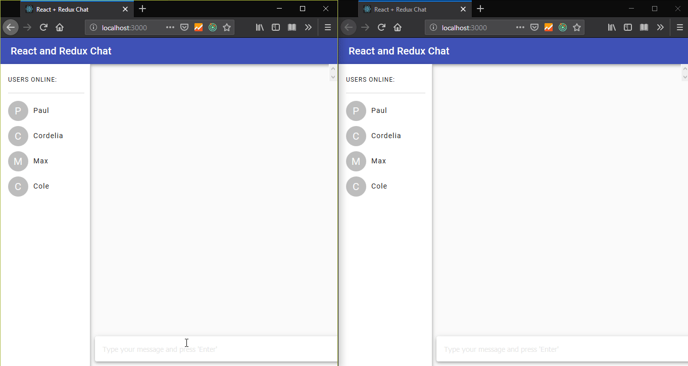

# React & Redux IM with WebSockets
A super basic instant messaging chat app that works with React, Redux and WebSockets. It's pure front-end so it can be re-used as needed with anything.

Every user in the session gets assigned a random name which appears in the sidebar.

## Available Scripts

In the project directory, you can run:

`$ npm start`

Start the development server.

`$ npm test`

Start the test suite.

`$ npm run build`

Build for production.

`$ npm run eject`

Eject everything to use a custom build configuration.